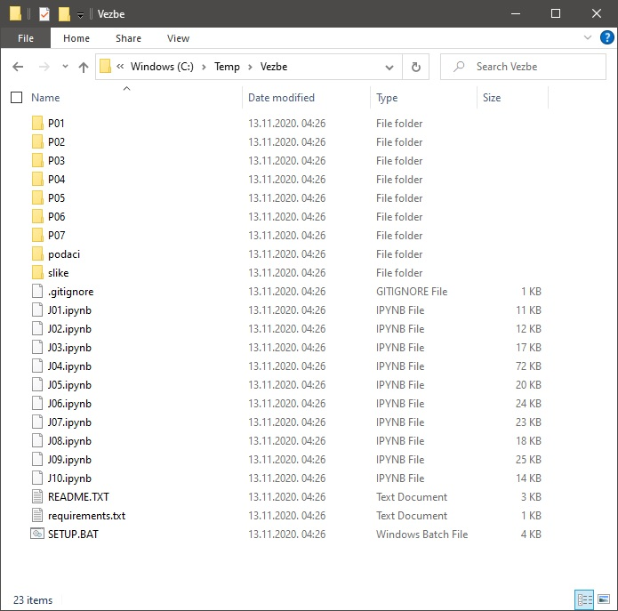
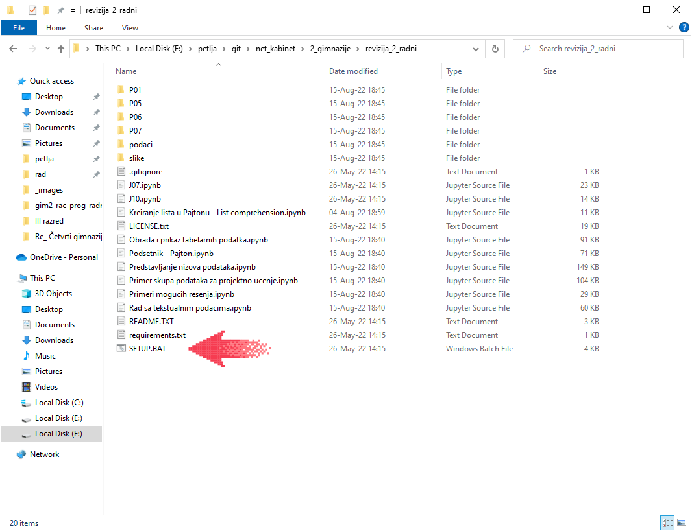
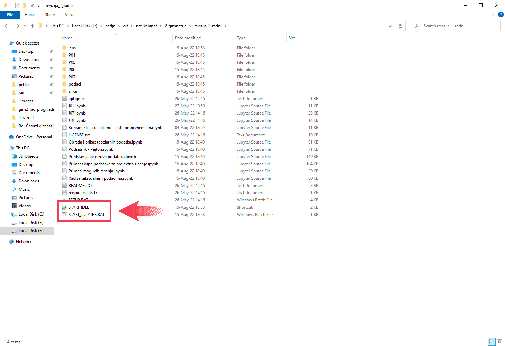
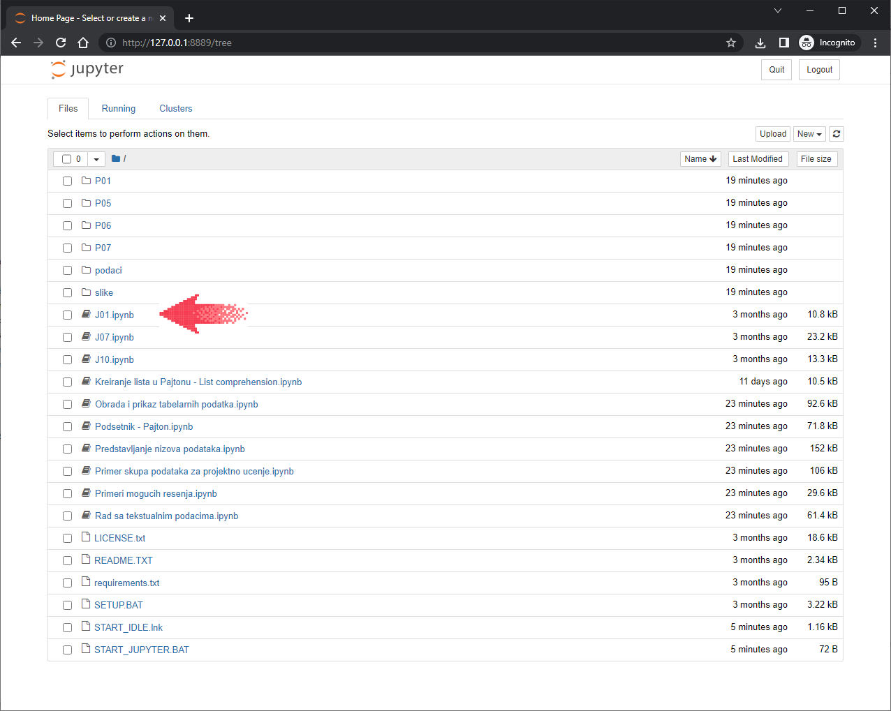

Покретање Џупитер (*Jupyter*) радних свески
============================================

Сада ћемо продискутовати о неколико начина да се покрену Џупитер интерактивне радне свеске. Тако ћеш добити могућност да сâм/сама прођеш кроз примере и задатке који су предвиђени овим курсом.

Џупитер интерактивне радне свеске се могу покренути на више начина, а ми ћемо ти показати како да свеске покренеш на твом рачунару (потребно је инсталирати Пајтон).

Покретање Џупитер радних свески на твом рачунару
-------------------------------------------------

Ово је свакако најфлексибилнији начин да се користе Џупитер радне свеске, али зато захтева највише припрема.

**Корак 1.** Ако имаш инсталиран Пајтон на свом рачунару, пређи на Корак 2.

Ако немаш инсталиран Пајтон на свом рачунару, прати први део следећег упутства (за рад са Џупитер радним свескама не треба ти *Pygame*, зато је довољно пратити само први део упутства који се односи на Пајтон):

`Упутство за инсталацију Пајтона <https://petljamediastorage.blob.core.windows.net/root/Media/Default/Help/Uputstvo%20Python%20pygame.pdf>`_

**Корак 2.** Са следећег линка...

`https://github.com/Petlja/VIII_prog_rev_radni/archive/refs/heads/main.zip <https://github.com/Petlja/VIII_prog_rev_radni/archive/refs/heads/main.zip>`_

\.... преузми ZIP фајл и распакуј га у неки фолдер на свом рачунару:

Потом покрени команду SETUP.BAT тако што ћеш два пута кликнути на њено име:

Ова команда ће радити неко време и при томе ће инсталирати све неопходне библиотеке
за рад са Џупитер окружењем:

.. image:: ../../_images/inst101c.jpg
   :width: 600px
   :align: center

Када се команда заврши у фолдеру ће се појавити команда START_JUPYTER.BAT и пречица
START_IDLE:

Пречица START_IDLE ће нам требати у наредном сегменту курса у коме обрађујемо
програмирање у Пајтону и за сада је слободно можемо игнорисати.

За покретање Џупитера треба да покренеш команду START_JUPYTER.BAT
тако што ћеш два пута кликнути на њено име.

На твом рачунару ће се отворити веб-прегледач са страном на којој се
виде линкови на радне свеске. Кликом на име, радна свеска се отвара у новом табу веб-прегледача:

Крени да читаш свеске и да их извршаваш корак по корак.

Ево и кратког видеа у коме је ово демонстрирано:

.. ytpopup:: LRMlIIv1maQ
   :width: 735
   :height: 415
   :align: center

