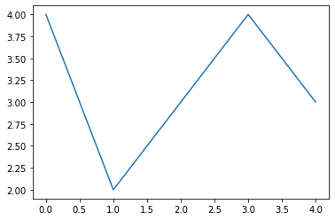

Елементи програмирања у Пајтону
===============================

Имајући у виду да ученици осмог разреда могу имати битно различито предзнање и искуство у програмирању, на почетку овог приручника дајемо кратак преглед елеменaта и правила потребних за програмирање у Пајтону. Некима су ови елементи познати па не морају да се задржавају на овом тексту. Другима је згодно да имају подсетник или да опет прочитају шта су основни елементи. Сами одлучите на који начин ћете читати текст или пробати линије кôда у овој свесци.

Типови података
---------------

У програмирању разликујемо три основне врсте података: нумеричке
(бројевe различитих типова, нпр. ``-3`` или ``4.17``), „стрингове“
(текстуалне или знаковне податке, нпр. ``"Пајтон"`` или ``"###"``) и
„булеане“ (логичке податке: тачно или нетачно, тј. ``True`` или
``False``). У Пајтону постоји финија подела на типове податка, нпр. на
целе бројеве (*integer*), децималне бројеве (*float*), стрингове
(*string*) или листе (*list*). Свака употреба података подразумева да
подаци одговарају намени. Уколико то није случај, програм ће при
извршењу пријавити грешку. Не можемо, на пример, да тражимо елемент низа
са редним бројем 2.17 или да израчунамо корен из стринга „девет“. Свако
програмирање подразумава да неким променљивим вредностима доделимо
вредности. Пајтон нас неће терати да унапред кажемо ког је типа
променљива, већ ће покушати сам да је препозна. Свеједно, морамо да
водимо рачуна о типу података са којима радимо и да будемо доследни.

Нумерички подаци
~~~~~~~~~~~~~~~~

Пајтон познаје три типа нумеричких, односно бројчаних података:
целобројне вредности (*integer*), децималне бројеве (*float*) и
комплексне бројеве (*complex*). Овим последњим типом се свакако нећемо
бавити у основној школи. Ког је типа променљива, увек можемо да
проверимо помоћу функције ``type()``.

.. activecode:: tip_int
    :nocodelens:

    i=10
    print(type(i))

Број 10 је свакако цео број, али такође припада и скупу рационалних и
реалних бројева. Разлог због ког је Пајтон тип ове променљиве препознао
баш као ``int`` је то што бира најекономичнију варијанту. Број 10 ће
имати најмањи запис и трошити најмање меморије ако га чувамо као
„интиџер“. Уколико број има децимални запис (макар иза децималне тачке
стајала и нула), тип тог податка ће бити препознат као ``float``.

.. activecode:: float_tip
    :nocodelens:
    
    f=10.0
    print(type(f))

Знаковни подаци
~~~~~~~~~~~~~~~

Знаковне податке обично називамо стринговима или нискама. Одатле ознака
типа ``str``. То су низови алфа-нумеричких карактера записани као текст.
Када променљивој додељујемо вредност која је низ знакова, онда тај
садржај стављамо под једноструке или двоструке знаке навода. Битно је да
на почетку и на крају буде иста врста наводника.

.. activecode:: tip_string
    :nocodelens:

    s='Programiranje u Pajtonu'
    print(type(s))

Логичке вредности
~~~~~~~~~~~~~~~~~

Тип променљиве која садржи вредност логичког исказа називамо булеан
(*boolean*). Булеани имају своје вредности које могу да буду или тачно
(*True*) или нетачно (*False*). Свако поређење вредности променљивих
(било ког типа) помоћу оператора једнако (``==``), није једнако
(``!=``), мање (``<``), мање или једнако (``<=``), веће (``>``) и веће
или једнако (``>=``) резултује логичком вредношћу.

.. activecode:: poredjenje
    :nocodelens:

    provera = 5==5.0 
    print(provera)

.. questionnote::
    
    Замените у претходном пољу оператор ``==`` неким другим логичким оператором. Шта се догађа? У којим је све случајевима резултат ``True``.

.. activecode:: print_tip_bool
    :nocodelens:

    print(type(5==5.0))

Операције за рад са логичким вредностима су логичко и (``and`` или
``&``), логичко или (``or`` или ``|``) и не (``not``). Резултати ових
логичких операција су такође логичке вредности.

.. activecode:: bool_provera
    :nocodelens:

    provera = (5==5) and (5!=6)
    print(provera)

Претварање променљивих у други тип податка
~~~~~~~~~~~~~~~~~~~~~~~~~~~~~~~~~~~~~~~~~~

У неким случајевима, тип податка је могуће претворити у други. На пример
стринг “2.75” лако може да се претвори у децимални број 2.75 уз помоћ
функције ``float()``. Обрнуто такође важи. Сада користимо функцију
``str()``.

.. activecode:: str_to_float
    :nocodelens:

    a = '2.75'
    b = float(a)
    print(type(b))
    print(b)

.. activecode:: float_to_str
    :nocodelens:

    a = 1/7
    b = str(a)
    print(type(b))
    print(b)

Претварање интиџера у децимални број је једнозначно - само се промени
формат, а вредност остаје иста. У супротном смеру морамо да претворимо
број на целобројну вредност, тј. занемаримо цифре иза децималне тачке,
због чега се вредност променљиве унеколико мења.

.. activecode:: float_int
    :nocodelens:

    a = 3
    b = float(a)
    print(type(b))
    print(b)

.. activecode:: float_to_int
    :nocodelens:

    a = 3.333
    b = int(a)
    print(type(b))
    print(b)

Колекције
---------

.. infonote::

    Пајтон различите врсте скупова података назива колекцијама. Постоје четири основне колекције које имамо на располагању чим покренемо Пајтон. То су **листе**, **речници**, **торке** и **скупови**. Ове године ћемо радити само са листама. (За детаљнији увод у листе можете да погледајте лекцију из `приручника за шести разред <https://petlja.org/kurs/368/14/5613>`__.)

Листе (``list``)
~~~~~~~~~~~~~~~~

Листу правимо тако што унутар угластих заграда наводимо различите
податке раздвајајући их зарезом. Елементи листе могу бити подаци свих
типова, па чак и саме листе. Подаци могу да се понављају. Важна
карактеристика листа је да су елементи нумерисани. Сваки елемент има
свој индекс који почиње од нуле. Елементи из листе се позивају преко
имена листе и индекса у угластим заградама.

.. activecode:: lista_1
    :nocodelens:

    lista=[2,3,'četiri']
    print(lista[2])

Функција ``range()``
~~~~~~~~~~~~~~~~~~~~

Функција ``range(n)`` враћа низ бројева од 0 до n-1 у формату који
заправо не одговара ни једној од четири поменуте колекције, али је
погодан за прављење петљи. Понекад и за излаз функције ``range()`` са
конкретним аргументом кажемо да је колекција. У општем случају, синтакса
ове функције је ``range(<старт>, <крај>, <корак>)`` где појединачни
аргументи означавају прву вредност, вредност на којој се низ зауставља и
корак са којим се вредности мењају.

.. activecode:: lista_2
    :nocodelens:

    a = len(range(0,30,5))
    print(a)

Петље
-----

Када део програма треба да поновимо више пута, пожељно је да тај кôд
ставимо у петљу. Петља је програмска структура која нам омогућава да
контролишемо колико ће се пута блок инструкција извршавати. Свако
извршавање кôда у петљи назива се **итерација**. Променљива која броји
колико пута је блок инструкција извршен назива се **итератор** или
**бројач**.

Најчешће коришћена петља у Пајтону је *for* петља. Ова петља почиње
инструкцијом ``for``, иза које иде услов да се бројач (итератор) налази у
колекцији која следи. Оператор ``in`` између бројача и колекције
означава услов да вредност бројача припада том скупу вредности. Прва
линија петље завршава се знаком две тачке ``:``. Следи блок инструкција
који при писању мора да буде увучен.

Петља у наредној ћелији користи излаз функције ``range(10)`` као
колекцију. Ово је пример једноставног програма који исписује бројеве од
0 до 9.

.. activecode:: petlja_osnovna
    :nocodelens:

    for i in range(10):
        print(i)

Скуп вредности које узима променљива током итерирања овде је био
дефинисан са ``range(10)``, што је распон бројева од 0 до 9. Како у
Пајтону индексирање увек почиње од нуле, вредности ове „итерабле“ иду од
0 до 9. Реч **итерабла** се односи на све колекције кроз које Пајтон
може да пролази секвенцијално, односно тачно утврђеним редоследом од
прве до последње вредности. Листе су такође итерабле па и њих можемо да
користимо за конструисање петљи. Када итерирамо по колекцији типа
*range*, итератори су бројеви. Ако користимо листу као итераблу, онда су
вредности итератора вредности из листе које редом узимамо.

.. activecode:: petlja_lista 
    :nocodelens:

    for s in ['први','други','трећи']:
        print(s)

Итерабле такође могу да буду и скупови, стрингови, торке итд. Стринг
није ништа друго до листа карактера. Зато можемо да итерирамо кроз
стринг, односно да правимо петљу у којој ће итератор узимати вредности
из стринга. Ево једноставног примера:

.. activecode:: petlja_string
    :nocodelens:

    for c in "Python":
        print(c)

    
Осим *for* петље, Пајтон има и *while* петљу. Код ње није битно да
итератор буде у одређеном скупу. *while* петља се извршава док год је
припадајући услов испуњен, односно док је логички исказ тачан. Ево
начина како пример са *for* петљом можемо да напишемо користећи
инструкцију ``while``.

.. activecode:: petlja_while

    i=0
    while i<10:
        print(i)
        i+=1
    

.. suggestionnote::
    
    Приметите да овде „ручно“ морамо да мењамо вредност индекса ``i``. Израз
    ``i+=1`` је скраћени запис од ``i=i+1``. То значи да у свакој итерацији
    вредност индекса ``i`` повећавамо за 1.

Угњеждене петље
~~~~~~~~~~~~~~~

Унутар једне петље лако можете да ставите другу. Пазите само да
итератори имају различита имена. Типичан пример проблема који можете да
решите петљом у петљи је да направите табелу где рачунате резултате неке
операције између свака два елемента низа. Конкретно, можемо да направимо
таблицу множења. Потребно је само сваки елемент једног низа помножити са
сваким елементом другог. Следи пример једноставног програма који то
рачуна и исписује на екрану.

.. activecode:: nested_1
    :nocodelens:

    n=5
    for i in range(1,n+1):
        for j in range (1,n+1):
            print(i*j,end="\t")
        print("\n")
    

Ако занемарите мало чудан начин исписа, програм је крајње једноставан.
Узимамо све бројеве од 1 до 5, множимо сваки са сваким и приказујемо то
на екрану. Оно што је необично код исписа је што смо ставили да се испис
завршава „табом“, а не новим редом. То нам омогућава да испишемо 5
резултата у једном реду. Ред завршавамо тек када унутрашња петља стигне
до краја. Контролни знак за таб је „\\t“, а за нови ред „\\n“.

Условно гранање
---------------

Да би програм могао да одлучи који део кôда треба да изврши потребно је
да провери испуњеност траженог критеријума, односно да евалуира
(вреднује) одговарајући логички исказ. У зависности од тога да ли је
услов испуњен или не, програм ће извршавати различите делове кôда. У
Пајтону се најчешће користи *if-then-else* конструкција. Прво
проверавамо да ли је испуњен услов наведен иза *if*, ако јесте онда
програм извршава оно што иде после *then*, а ако није испуњен извршава
оно што следи после *else*. Погледајте пример:

.. activecode:: uslovi
    :nocodelens:

    a=int(input())
    if a%2==0:
        print('паран')
    else:
        print('непаран')
    
У овом примеру прво тражимо да неко помоћу тастатуре укуца број, онда
тај унос претворимо у интиџер и придружимо га промељивој ``a``. У
следећој линији проверавамо да ли је тај број дељив са 2, односно да ли
је остатак при дељењу са 2 једнак нули. Потом, као увучени блок
инструкција, иде оно што треба извршити ако је услов испуњен, тј. да
програм испише да је унети број паран. У противном, програм извршава
следећи увучени блок инструкција и исписује да је број непаран.

Обратите пажњу на синтаксу. У Пајтону се инструкција *then* уопште не
користи. Уместо тога користе се знак ``:`` и увучени блокови
инструкција. Видите како се после реда који се завршава са ``:``
појављује увучени део кôда. Први блок инструкција (који може да има
произвољно много линија кôда) извршава се ако је услов испуњен, а други
блок (после ``else:``) ако услов није испуњен.

Уколико гранање на две могућности није довољно, можемо да уведемо и нове
блокове помоћу ``elif`` инструкције. Нема ограничења колико ових услова
може да буде. Када први услов није испуњен, онда можемо да испитамо да
ли је неки други услов испуњен помоћу ``elif``. Погледајте пример:

.. activecode:: elif
    :nocodelens:

    a=5
    b=6
    if a==b:
        print('a i b su jednaki.')
    elif a<b:
        print('a je manje od b.')
    else:
        print('a je veće od b.')       

Други начин да проверимо више услова јесте да у *if-then-else* блоковима
уведемо нове услове и ново гранање. Ако то радите, обратите пажњу да ти
нови блокови морају да буду још једном увучени помоћу табулатора. Ако су
они први били по 4 размака (1 “таб”), онда ови угњеждени морају да буду
по 8 (2 “таба”). Едитор у коме радите обично води рачуна о увлачењу
блокова, али није лоше да проверите да ли је све увучено како треба. За
разлику од неких других програмских језика, Пајтон неће да ради и
пријављује грешку ако блокови нису правилно увучени. Ево начина како
смо претходни пример могли да урадимо са угњежденим условима:

.. activecode:: else
    :nocodelens:

    a=6
    b=6
    if a<b:
        print("a je manje od b.")
    else:
        if a==b:
            print("a i b su jednaki.")
        else:
            print("a je veće od b.")

Функције
--------

Пајтон има неке уграђене функције као што су ``sum()`` или ``min()``,
али за конкретну намену сами можемо да напишемо нову функцију. Функције
се једноставно дефинишу: у првој линији пишемо
``def <име функције>(<име променљиве у коју се смешта аргумент>):``,
онда следи блок инструкција којима обрађујемо и рачунамо нешто са
улазном променљивом и на крају, у последњој линији, пишемо
``return <име излазне променљиве>``. Свака функција може да има више
улазних променљивих, као што може да врати и више излазних.

Први пример функције који ћемо овде приказати је рачунање производа свих
вредности у листи. Оваква функција не постоји у стандардној Пајтоновој
библиотеци. Зато је добро да знамо да је напишемо.

.. activecode:: funkcije
    :nocodelens:

    def proizvod(L):     # argument, odnosno lista koju prosleđujemo funkciji biće smeštena u promenljivu L 
        p=1              # početna vrednost proizvoda je 1
        for x in L:      # za svaku vrednost iz liste
            p=p*x        # tekuću vrednost proizvoda množimo tom vrednošću
        return p         # funkcija vraća proizvod svih vrednosti u listi
    print(proizvod([1,2,3,4,5]))

.. questionnote:: 

    Задатак: Можете ли, по угледу на претходни пример, сами да напишете функцију ``zbir()`` која би сабрала све елементе листе?

    
.. activecode:: zbir_test
   :nocodelens:
   :runortest: test1, test2, test3
		
   # -*- acsection: general-init -*-
   # -*- acsection: main -*-
   def zbir(L):
       # dopuni ovu fuknkciju
   # Провера
   test1 = zbir([1, 2, 3, 4, 5])
   test2 = zbir([100, 200, 500])
   test3 = zbir([-1, 0, 0, 4, 5]) 
   # -*- acsection: after-main -*-
   print(test1, test2, test3)
   ====
   from unittest.gui import TestCaseGui
   class myTests(TestCaseGui):
       def testOne(self):
           L = [1, 2, 3, 4, 5]; rez1 = sum(L)
           L = [100, 200, 500]; rez2 = sum(L)
           L = [-1, 0, 0, 4, 5]; rez3 = sum(L)
           run_test = acMainSection(test1=test1,test2=test2,test3=test3)
           self.assertEqual(run_test["test1"], rez1, "Вредност променљиве 'test1' треба да буде %s" % rez1)
           self.assertEqual(run_test["test2"], rez2, "Вредност променљиве 'test2' треба да буде %s" % rez2)
           self.assertEqual(run_test["test3"], rez3, "Вредност променљиве 'test3' треба да буде %s" % rez3)
   myTests().main() 

Како бисте написали функцију чији је улаз листа, а излаз најмања
вредност из те листе? Та функција треба да пронађе најмању вредност у
листи и да је врати. Оваква функција већ постоји у Пајтону и зове се
``min()``, али ћемо искористи прилику да напишемо своју верзију. Име ове
нове функције ће бити ``minimum()``. Ево једне могућности како то може
да се напише.

.. activecode:: min
    :nocodelens:

    def minimum(L): 
        m=L[0]            # za početak, najmanja vrednost će biti ona prva u listi
        for x in L[1:]:   # iteracije kreću od druge vrednosti u listi i idu do kraja
            if x<m:       # ako je tekuća vrednost iteratora x manja od m, tj. one koja je do sada bila najmanja
                m=x       # onda neka novi minimum bude x
        return m          # na kraju funkcija vraća vrednost m
    lista=[11,22,33,14,25,36,17,28,39,10,21,32]
    print(minimum(lista)) # u okviru funkcije print, pozivamo funkciju minimum u kojoj je argument promenljiva lista 

Библиотеке
----------

Пајтон без додатних библиотека има само основне типове података,
структуре и функције. У тој стандардној библиотеци нема структура у
којима бисмо чували табеле, нема функција које би цртале графиконе или
чак рачунале једноставне математичке функције. За све то је потребно да
учитамо библиотеке, модуле из библиотека или њихове појединачне
функције. Срећом, Пајтон има огроман број врло квалитетних библиотека до
којих се лако долази.

Библиотеке се састоје из модула који у себи садрже разне типове
података, објекте, функције и методе за те објекте итд. Стандардна
библиотека има неколико модула које не учитава аутоматски. То значи да
су модули инсталирани, али да треба да их учитамо. Међу њима су модули
који су нам често потребни као што су ``math`` (математичке функције),
``random`` (генерисање случајних бројева) или ``statistics``
(статистичке функције).

Када увеземо целу библиотеку или модул помоћу инструкције ``import``,
можемо да користимо све њене функције и објекте само морамо да наведемо
одакле су преузети. На пример, када учитамо библиотеку ``math``, добићемо
и функције и константе које уз њу иду. Кад их позивамо, прво куцамо име
библиотеке са тачком на крају, тј. ``math.`` па онда име функције или
константе.

.. activecode:: import
    :nocodelens:

    import math           # uvozimo biblioteku math
    print(math.pi)        # ispisujemo konstantu pi
    print(math.sqrt(81))  # ispisujemo kvadratni koren iz 81
    

Има библиотека које имају непрактично дуга имена па би било тешко стално
укуцавати њихова имена кад хоћемо да позивамо њихове функције. У тим
случајевима већ при учитавању библиотеке кажемо Пајтону да ћемо је
убудуће позивати по „надимку“, тј. скраћеној верзији имена коју можемо
сами да смислимо. У следећој ћелији је пример како увозимо библиотеку
``matploylib.pyplot`` одређујући да ћемо је убудуће звати само ``plt``.

.. code:: ipython3

    import matplotlib.pyplot as plt
    plt.plot([4,2,3,4,3])

.. parsed-literal::

    [<matplotlib.lines.Line2D at 0x1bdb561ab80>]

Ако нас интересује само једна функција из библиотеке, можемо њу посебно
да учитамо помоћу линије
``from <назив библиотеке> import <назив функције>``. Тада при употреби
не морамо да наводимо из које је библиотеке. На пример, ако из целог
модула ``statistics`` хоћемо само функцију ``mean()`` која рачуна средњу
вредност низа, то можемо да урадимо на следећи начин:

.. code:: ipython3

    from statistics import mean
    mean([3,4,4,6])

.. parsed-literal::

    4.25

Многе важне екстерне библиотеке су већ инсталиране у Џупитер окружењу.
Оне које се најчешће користе су ``pandas`` за рад са табелама и
фајловима, ``matplotlib.pyplot`` за цртање графикона и ``numpy`` за рад
са вишедимензионалним подацима. Уколико тражене библиотеке нема у
окружењу, потребно је да је инсталирате. У већини случајева нема потребе
да библиотеку тражите на интернету и да је преузимате. Довољно је да
укуцате ``pip install <назив библиотеке>`` и Пајтон ће библиотеку сам
пронаћи, преузети и инсталирати.
