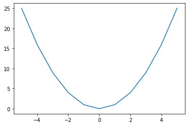

Линијски, тачкасти и стубичасти дијаграми
------------------------------------------

Екран рачунара, као и папир на ком цртамо графиконе, има две димензије
које користимо за потребе визуелизације. Где год да ставимо тачку, она
има две координате: *x* по хоризонтали и *y* по вертикали. Како год да
приказујемо податке, морамо да их сведемо на две димензије и да цео
графикон прикажемо као скуп тачака у равни. Због тога су
најједноставнији они графикони где низ тачака одређују два низа
координата, један за *x*, други за *y*-осу.

.. technicalnote::

    Препоручујемо да ову лекцију покренеш на свом рачунару тако што ћеш у `фолдеру за рад офлајн <https://github.com/Petlja/VIII_prog_rev_radni/archive/refs/heads/main.zip>`_ покренути Џупитер свеску `Graficko predstavljanje podataka.ipynb` на начин на који је то објашњено у поглављу `Покретање Џупитер радних свески </J0A/J0A.html#jupyter>`_ у уводу овог приручника. 

У следећем примеру ћемо помоћу функције ``.scatter()`` приказати тачке
одређене са два низа координата: ``x=[3,4,5]`` и ``y=[4,2,1]``.
Приметите како за низове координата користимо листе. Тако је
најједноставније.

.. code:: ipython3

    x=[3,4,5]
    y=[4,2,1]
    plt.scatter(x,y)

.. parsed-literal::

    <matplotlib.collections.PathCollection at 0x22076097ee0>

.. image:: ../../_images/output_10_1.png
    :align: center
    :width: 500px

Вероватно примећујете да координатни систем не почиње од нуле. Функција
сама подешава границе тако да максимално искорити простор који је на
располагању. То можете да промените сами помоћу функција ``.xlim()`` и
``.ylim()``. Ставите, на пример,

.. code:: ipython3

   plt.xlim([0,6])
   plt.ylim([0,6])

одмах после линије у којој је ``.scatter()`` функција.

Претходни пример је вероватно превише једноставан па ћемо дати један
сложенији. Ми у пракси ретко кад укуцавамо све вредности које треба
приказати на графику. Податке за график или учитавамо из неког фајла или
их рачунамо. Овде ћемо дати пример са рачунањем вредности. Конкретно,
узећемо све целобројне вредности од -5 до 5 за *x* координату, а њихове
квадрате за *y* координату.

Начин на који записујемо све бројаве од -5 до 5 вам је можда необичан,
али не желимо да куцамо свих 11 бројева. Зато користимо колекцију типа
``range()`` која даје све те бројеве, да би је потом претворили у листу
помоћу функције ``list()``. За другу координату рачунамо вредности
користећи *list comprehension* конструкцију. Унутар угластих заграда
пише да у листу уносимо квадрате броја ``t`` за свако ``t`` из листе
``x``. На крају прикажемо податке на графику као што смо радили и у
претходном примеру.

.. code:: ipython3

    x=list(range(-5,6))
    y=[t**2 for t in x]
    plt.scatter(x,y)

.. parsed-literal::

    <matplotlib.collections.PathCollection at 0x22076869790>

.. image:: ../../_images/output_13_1.png
    :align: center
    :width: 500px

Тачкасти дијаграми су стандарни начин приказа података који су добијени
мерењем. Ипак, често се уместо тачкастих користе линијски дијаграми који
суседне тачке у низу повезују правим линијама, односно дужима. За овај
тип дијаграма користимо функцију ``.plot()``. Да видимо сад исте оне
податке од малопре на линијском дијаграму.

.. code:: ipython3

    x=list(range(-5,6))
    y=[t**2 for t in x]
    plt.plot(x,y)

.. parsed-literal::

    [<matplotlib.lines.Line2D at 0x220768cebb0>]

Овако смо добили изломљену криву линију која личи на параболу. Ако
хоћете да буде мање изломљена, узмите више тачака из интервала од -5 до
5.

Некад имамо само један низ података који хоћемо да прикажемо графички.
На пример, број поена који је дао Стеф Кари у финалној серији НБА лиге
(2022. године): 34, 29, 31, 43, 16, 34. Како да прикажемо ове податке
кад имамо само једну координату? Истина је, заправо, да имамо и другу,
само што није експлицитно наведена. То је редни број утакмице. Пошто
података о броју поена има шест, онда су одговарајуће вредности за
*x*-координату бројеви од 1 до 6.

.. code:: ipython3

    pts=[34,29,31,43,16,34]
    plt.bar([1,2,3,4,5,6],pts)

.. parsed-literal::

    <BarContainer object of 6 artists>

За разлику од тачкастих и линијских дијаграма где вредности за *x* и *y*
координате могу да имају било које нецелобројне вредности, стубичне
дијаграме обично користимо за податке који на *x*-оси имају узастопне
целобројне вредности, редне бројеве или стрингове као називе категорија.
Идеја стубичастог дијагарама је да омогући лако поређење између вредности
у низу. То се најбоље види ако су разлике између *x*-вредности суседних
стубића свугде исте. Због тога су редни бројеви или називи категорија
идеални за ознаке на *x*-оси.

Уместо бројева од 1 до 6 можемо да ставимо одговарајућа имена
категорија, нпр. “прва”, “друга”, …, “шеста” утакмица. Графикон ће и
тада изгледати исто, само ће ознаке на *x*-оси бити другачије.

.. code:: ipython3

    plt.bar(['прва','друга','трећа','четврта','пета','шеста'],pts)

.. parsed-literal::

    <BarContainer object of 6 artists>

.. image:: ../../_images/output_21_1.png
    :align: center
    :width: 500px

Секторски дијаграми (или “питице”) могу да прикажу исте ове податке. Они
површину круга деле на делове (секторе) чије су површине сразмерне
вредностима у низу. Овај тип дијаграма се сматра атрактивним иако има
лошу прегледност и слабе могућности поређења вредности у низу. Секторске
дијаграме не би требало користити када је потребно да се лако упореде
вредности у низу или да се уочи тренд промене.

.. code:: ipython3

    plt.pie(pts,labels=['прва','друга','трећа','четврта','пета','шеста'])
    plt.grid()

