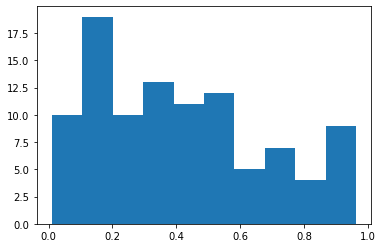
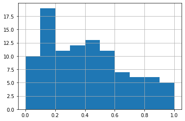

Хистограм
---------

Хистограм је графички приказ расподеле бројчаних података у одређеном
скупу. Идеја хистограма је да се распон од најмањег до највећег броја у
скупу подели на интервале исте ширине, да се преброји колико бројева
упада у који од тих интервала и да се, коначно, резултат тог
пребројавања прикаже као стубичасти дијаграм по тим интервалима.

.. technicalnote::

    Препоручујемо да ову лекцију покренеш на свом рачунару тако што ћеш у `фолдеру за рад офлајн <https://github.com/Petlja/VIII_prog_rev_radni/archive/refs/heads/main.zip>`_ покренути Џупитер свеску `04_Graficko_predstavljanje_podataka.ipynb` на начин на који је то објашњено у поглављу `Покретање Џупитер радних свески <https://petlja.org/kurs/479/1/6123>`_ у уводу овог приручника. 

Иако хистограм изгледа као стубичасти дијаграм, постоје разлике. Док се
стубичасти дијаграм приказује за низ бројева на *x*-оси, код хистограма се
стубићи придружују интервалима. Осим тога, хистограм пре приказивања
ради статистичку обраду података, односно дељење на интервале и
пребројавање одговарајућих вредности.

Да бисмо добили неке случајне вредности бројева које треба приказати на
хистограму, прво ћемо генерисати један низ таквих бројева помоћу функције
``.random()`` из ``random`` библиотеке. Ова функција даје случајан број
између 0 и 1. Ако 100 пута генеришемо случајан број на овај начин и све
их ставимо у листу, добићемо низ од 100 независно добијених случајних
бројева.

.. code:: ipython3

    import random                             # prvo uvozimo biblioteku
    rb=[random.random() for i in range(100)]  # za pravljenje liste koristimo list comprehension
    print(rb[0:6])                            # prikazujemo prvih šest brojeva iz liste

.. parsed-literal::

    [0.5413070982217821, 0.9631491205251442, 0.8753602933610914, 0.1518393919547817, 0.15123373335693346, 0.3409180935486018]
    

Да не бисмо штампали вредности свих сто елемената листе, боље да их
прикажемо као хистограм. За то користимо функцију ``hist()`` која има
само један аргумент: назив листе.

.. code:: ipython3

    plt.hist(rb)

.. parsed-literal::

    (array([10., 19., 10., 13., 11., 12.,  5.,  7.,  4.,  9.]),
     array([0.01003802, 0.10534913, 0.20066024, 0.29597135, 0.39128246,
            0.48659357, 0.58190468, 0.67721579, 0.7725269 , 0.86783801,
            0.96314912]),
     <BarContainer object of 10 artists>)

Добили смо хистограм. Он, истини за вољу, није најпрегледнији јер не
знамо где су тачно границе интервала и колике су за њих вредности
стубића. То можемо још мало да средимо. Прво ћемо да кажемо функцији
``.hist()`` да не дели интервал од најмање до највеће вредности на
подинтервале, него да то уради за интервал од 0 до 1. То радимо тако што
функцији уз аргумент који смо већ унели, саопштимо и да су границе тог
великог интервала (*range*) 0 и 1. Онда ће границе подинтервала бити
тачно на 0, 0.1, 0.2, итд. Друго, нацртаћемо мрежу (*grid*) преко
графика да бисмо боље видели вредности и границе интервала.

.. code:: ipython3

    plt.hist(rb,range=(0,1))
    plt.grid()

Сада је резултат свакако прегледнији и лакши за читање.
