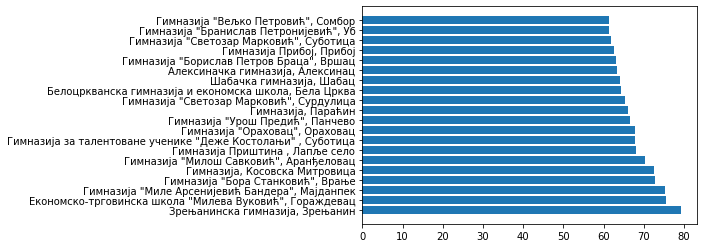

Основе обраде и приказа табеларних података
===========================================

Обраду, анализу и графички приказ података је тешко раздвојити. Све то
углавном иде паралелно. У Пајтону постоји неколико најчешће коришћених
библиотека које су усаглашене тако да објекти које користимо за обраду
података имају функције за цртање, а функције за цртање враћају табеле и
серије. Зато је то овде једна лекција.

Обрада табеларних података
--------------------------

Много тога за шта су нам потребни програмерско знање и труд при обради
података у листама, постаје једноставна примена готових функција када
податке спакујемо у *DataFrame*. На тај начин нам библиотека *pandas*
омогућава да рад са табелама буде једноставан, брз и ефикасан.

.. technicalnote::

    Препоручујемо да ову лекцију покренеш на свом рачунару тако што ћеш у `фолдеру за рад офлајн <https://github.com/Petlja/VIII_prog_rev_radni/archive/refs/heads/main.zip>`_ покренути Џупитер свеску `06_Osnove obrade i prikaza tabelarnih podataka.ipynb` на начин на који је то објашњено у поглављу `Покретање Џупитер радних свески </J0A/J0A.html#jupyter>`_ у уводу овог приручника. 

Учитавање табеле из датотеке
~~~~~~~~~~~~~~~~~~~~~~~~~~~~

Податке најчешће чувамо у табелама. Чак су и базе података само
колекције различитих табела. За поновну употребу табеле снимамо у
датотеке (или фајлове, како их понекад зовемо). Те снимљене табеле
касније учитавамо по потреби. Уобичајени формат датотека за снимање
табела је CSV (енгл. *comma separated value*, тј. вредности одвојене
зарезом). Библиотека *pandas* има функције за учитавање и снимање
табела. За учитавање користимо функцију ``pd.read_csv()``. Aргумент ове
функције је стринг са локацијом и називом датотеке, нпр.
“data/preostala-mesta-skole.csv”.

Ова датотека се не налази у Пајтоновом радном директоријуму већ у
поддиректоријуму *data*, због чега је потребно да то напишемо и да назив
директоријума и датотеке раздвојимо косом цртом. Учитаћемо сада баш ту
датотеку. У њој се налази листа средњих школа у Србији где је наведено
колико је било слободних места за упис после првог круга уписа 2022.
године.

.. code:: ipython3

    import pandas as pd                # prvo uvozimo pandas biblioteku
    import matplotlib.pyplot as plt    # i biblioteku za crtanje grafika

.. code:: ipython3

    dt = pd.read_csv('data/preostala-mesta-skole.csv')

При позивању функција из одређене библиотеке потребно је да наведемо
ознаке библиотека. Зато није довољно да напишемо ``read_csv()`` већ
морамо ``pd.read_csv()``. При увожењу библиотека ми смо нагласили да
ћемо користити скраћена имена уместо пуних. Користићемо ``pd`` уместо
``pandas`` и ``plt`` уместо ``matplotlib.pyplot`` што ће нам олакшати
писање кôда.

Садржај датотеке смо учитали и сместили у табелу (тачније променљиву
типа *dataframe*) ``dt``. Да бисмо видели шта је учитано, згодно је да
прикажемо на екрану заглавље те табеле са првих неколико редова. За то
нам служи функција ``.head()``.

.. code:: ipython3

    dt.head()

.. raw:: html

    

    
    <table border="1" class="dataframe">
      <thead>
        <tr style="text-align: right;">
          <th></th>
          <th>Општина</th>
          <th>Школа</th>
          <th>Мин. бодова</th>
          <th>Укупно места</th>
          <th>Преостало места</th>
        </tr>
      </thead>
      <tbody>
        <tr>
          <th>0</th>
          <td>Ада</td>
          <td>Техничка школа, Ада</td>
          <td>39.37</td>
          <td>150</td>
          <td>78</td>
        </tr>
        <tr>
          <th>1</th>
          <td>Александровац</td>
          <td>Средња школа "Свети Трифун" са домом ученика, ...</td>
          <td>42.77</td>
          <td>90</td>
          <td>48</td>
        </tr>
        <tr>
          <th>2</th>
          <td>Алексинац</td>
          <td>Алексиначка гимназија, Алексинац</td>
          <td>63.19</td>
          <td>90</td>
          <td>29</td>
        </tr>
        <tr>
          <th>3</th>
          <td>Алексинац</td>
          <td>Биотехнолошка школа "Шуматовац", Алексинац</td>
          <td>40.76</td>
          <td>60</td>
          <td>25</td>
        </tr>
        <tr>
          <th>4</th>
          <td>Алексинац</td>
          <td>Техничка школа "Прота Стеван Димитријевић", Ал...</td>
          <td>50.16</td>
          <td>30</td>
          <td>1</td>
        </tr>
      </tbody>
    </table>
    

Видимо да су у табели називи школа дати по врстама, а да по колонама
имамо основне податке о упису у тим државама. У колони **Општина** је
име општине у којој се налази школа, **Школа** означава назив школе са
именом места, **Мин. бодова** представља најмањи број бодова са којим се
у тој школи у првом кругу неко уписао, **Укупно места** означава број
одобрених места, а **Преостало места** је број непопуњених места у тој
школи. Називе свих колона можемо да добијемо помоћу ``dt.columns``.

.. code:: ipython3

    dt.columns

.. parsed-literal::

    Index(['Општина', 'Школа', 'Мин. бодова', 'Укупно места', 'Преостало места'], dtype='object')

Вредности које се налазе у одређеној колони се позивају тако што после
имена табеле у угластим заграда наведемо име колоне под једноструким или
двоструким наводницима. Да бисмо приказали колону са именима држава,
написаћемо ``dt['Школа']`` или ``dt["Школа"]``.

.. code:: ipython3

    dt['Школа']

.. parsed-literal::

    0                                    Техничка школа, Ада
    1      Средња школа "Свети Трифун" са домом ученика, ...
    2                       Алексиначка гимназија, Алексинац
    3             Биотехнолошка школа "Шуматовац", Алексинац
    4      Техничка школа "Прота Стеван Димитријевић", Ал...
                                 ...                        
    338                               Техничка школа , Шабац
    339                             Шабачка гимназија, Шабац
    340                      Гимназија "Сава Шумановић", Шид
    341                   Техничка школа "Никола Тесла", Шид
    342    Економско-трговинска школа "Јован Цвијић", Штрпце
    Name: Школа, Length: 343, dtype: object

Ако хоћете да видите само део ове листе, користите слајсове. Са
``[:10]`` ћете нпр. добити првих 10, а са ``[10:20]`` других 10
елемената колоне, а са ``[10:0:-1]`` првих десет у обрнутом редоследу.

.. code:: ipython3

    dt['Школа'][10:20]

.. parsed-literal::

    10                  Средња школа "Свети Ахилије", Ариље
    11    Средња школа "Вук Караџић" са домом ученика, Б...
    12                        Техничка школа , Бајина Башта
    13                               Средња школа, Барајево
    14                Средња школа "Никола Тесла", Баточина
    15                             Пољопривредна школа, Бач
    16               Гимназија "20. октобар", Бачка Паланка
    17    Средња стручна школа "Др Радивој Увалић", Бачк...
    18               Техничка школа "9. мај", Бачка Паланка
    19    Гимназија и економска школа "Доситеј Обрадовић...
    Name: Школа, dtype: object

Сортирање
~~~~~~~~~

Библиотека *pandas* има прегршт корисних функција за рад са табелама и
њиховим колонама. Функција ``.sort_values()`` сортира све вредности у
одређеној колони и прерасподељује садржај осталих колона у складу са
тим. Аргумент ове функције је назив колоне по којој хоћемо да сортирамо
табелу. Подразумева се да се сортирање ради од најмање до највеће
вредности. Уколико нам то не одговара и хоћемо сортирање у супротном
смеру, потребно је да наведемо и други аргумент: ``ascending=False``. То
буквално значи да не сортира у растућем (енгл. *ascending*) редоследу.
Примера ради, ако хоћемо да видимо у које су се школе ученици уписивали
са најмањим и највећим бројем бодова, можемо да сортирамо вредности по
тој колони и погледамо које се школе налазе на почетку и крају табеле.

.. code:: ipython3

    dt.sort_values('Мин. бодова')

.. raw:: html

    

    
    <table border="1" class="dataframe">
      <thead>
        <tr style="text-align: right;">
          <th></th>
          <th>Општина</th>
          <th>Школа</th>
          <th>Мин. бодова</th>
          <th>Укупно места</th>
          <th>Преостало места</th>
        </tr>
      </thead>
      <tbody>
        <tr>
          <th>244</th>
          <td>Пријепоље</td>
          <td>Техничка школа , Пријепоље</td>
          <td>28.73</td>
          <td>105</td>
          <td>52</td>
        </tr>
        <tr>
          <th>69</th>
          <td>Вучитрн</td>
          <td>Техничка школа "Никола Тесла" , Прилужје</td>
          <td>30.16</td>
          <td>60</td>
          <td>44</td>
        </tr>
        <tr>
          <th>272</th>
          <td>Сјеница</td>
          <td>Техничко - пољопривредна школа са домом ученик...</td>
          <td>30.47</td>
          <td>75</td>
          <td>41</td>
        </tr>
        <tr>
          <th>165</th>
          <td>Лесковац</td>
          <td>Школа за текстил и дизајн, Лесковац</td>
          <td>31.71</td>
          <td>90</td>
          <td>59</td>
        </tr>
        <tr>
          <th>68</th>
          <td>Вршац</td>
          <td>Школски центар "Никола Тесла", Вршац</td>
          <td>33.39</td>
          <td>30</td>
          <td>7</td>
        </tr>
        <tr>
          <th>...</th>
          <td>...</td>
          <td>...</td>
          <td>...</td>
          <td>...</td>
          <td>...</td>
        </tr>
        <tr>
          <th>228</th>
          <td>Пећ</td>
          <td>Економско-трговинска школа "Милева Вуковић", Г...</td>
          <td>75.44</td>
          <td>60</td>
          <td>56</td>
        </tr>
        <tr>
          <th>93</th>
          <td>Зрењанин</td>
          <td>Зрењанинска гимназија, Зрењанин</td>
          <td>79.25</td>
          <td>30</td>
          <td>24</td>
        </tr>
        <tr>
          <th>90</th>
          <td>Земун</td>
          <td>Школа за ученике оштећеног вида "Вељко Рамадан...</td>
          <td>NaN</td>
          <td>12</td>
          <td>12</td>
        </tr>
        <tr>
          <th>206</th>
          <td>Нови Сад</td>
          <td>Школа за основно и средње образовање "Милан Пе...</td>
          <td>NaN</td>
          <td>12</td>
          <td>12</td>
        </tr>
        <tr>
          <th>263</th>
          <td>Савски венац</td>
          <td>Школа за оштећене слухом-наглуве "Стефан Дечан...</td>
          <td>NaN</td>
          <td>6</td>
          <td>6</td>
        </tr>
      </tbody>
    </table>
    
343 rows × 5 columns

    

.. questionnote:: **Задатак 1**

  Сортирате табелу ``dt`` у по укупном броју места у школама од највеће до најмање вредности.

Видимо да има школа где се ученици са тридесетак бодова успешно уписују,
али да има и оних такав податак уопште није наведен. Ту се у табели
појављује ознака ``NaN``. Ако пажљивије погледамо табелу, видећемо да су
школе за које немамо податак о минималном броју бодова школе за ученике
са тешкоћама у развоју. То је вероватно разлог зашто број бодова није
био критеријум по ком су ученици уписивани.

Табеле са великим бројем редова нису прегледне чак ни када их сортирамо.
Зато је пожељно да направимо графички приказ који би нам помогао у
тумачењу података. Овде ћемо дати примере два типа дијаграма (стубичасти
дијаграм и хистограм) за приказ колона са бројем становника и површином
држава.

Прво дајемо стубичасти дијаграм. Аргументи функције су ознаке стубића
(име школе) и дужина стубића (минимални број бодова). Пошто школа у
табели има преко 200, тешко је направити прегледан график са свим
школама. Зато смо узели само првих двадесет школа са највећим бројем
бодова последњег уписаног ученика.

Због прегледности исписа згодније нам је да стубићи буду хоризонтални.
Зато користимо функцију ``barh()`` уместо ``bar()``. Пробајте и са
``bar()``, да видите како би изгледало.

.. code:: ipython3

    spd=dt.sort_values('Мин. бодова', ascending=False)   # sortiramo tabelu po min. broju bodova i dodeljujemo je novoj tabeli
    spd20=spd[:20]                                       # zbog preglednosti, pomoću slajsa, izdvajamo samo prvih 20 redova
    plt.barh(spd20['Школа'],spd20['Мин. бодова'],)       # crtamo horizontalni stubičasti dijagram 

.. parsed-literal::

    <BarContainer object of 20 artists>

.. questionnote:: **Задатак 2**:

  Напишите кôд који исписује имена десет школа са најмањим бројем преосталих места.

Други важан тип графикона за приказ расподеле података је хистограм. Он
нам приказује колико се пута у одређеном низу појављује вредност из
тачно одређених интервала вредности. На пример, хистограм може да нам
прикаже број школа по интервалима вредности за број преосталих места.
Функција ``.hist()`` дели интервал од најмање до највеће вредности на
десет једнаких под-интервала уколико не наведемо конкретан број
интервала као други аргумент функције и распон одакле докле желимо
хистограм као трећи аргумент. Сада ћемо приказтаи само ову основну
варијанту са једним аргуметном. Нешто касније ћете видети и како то
изгледа са три.

.. code:: ipython3

    plt.hist(dt['Преостало места'])
    plt.grid()                         # crtanje mreže na grafiku

.. image:: ../../_images/obrada_output_28_0.png
  :align: center
  :width: 500px
  

Филтрирање табеле
~~~~~~~~~~~~~~~~~

Филтрирање значи да од целе табеле желимо да издвојимо само оне редове
који нас интересују. За филтрирање података у табели користимо
критеријуме, односно логичке исказе као што је нпр.
``dt['Општина']=="Крагујевац"``. Овде проверавамо које су вредности у
колони ``dt['Општина']`` једнаке стрингу ``"Крагујевац"``. У угласте
заграде после назива табеле треба унети тражени критеријум. На тај начин
од целе почетне табеле издвајамо само онај део табеле где је критеријум
испуњен.

.. code:: ipython3

    dt[dt['Општина']=="Крагујевац"]

.. raw:: html

    

    
    <table border="1" class="dataframe">
      <thead>
        <tr style="text-align: right;">
          <th></th>
          <th>Општина</th>
          <th>Школа</th>
          <th>Мин. бодова</th>
          <th>Укупно места</th>
          <th>Преостало места</th>
        </tr>
      </thead>
      <tbody>
        <tr>
          <th>130</th>
          <td>Крагујевац</td>
          <td>Прва техничка школа, Крагујевац</td>
          <td>55.23</td>
          <td>30</td>
          <td>22</td>
        </tr>
        <tr>
          <th>131</th>
          <td>Крагујевац</td>
          <td>Средња стручна школа, Крагујевац</td>
          <td>41.35</td>
          <td>150</td>
          <td>101</td>
        </tr>
        <tr>
          <th>132</th>
          <td>Крагујевац</td>
          <td>Трговинско-угоститељска школа "Тоза Драговић",...</td>
          <td>42.16</td>
          <td>180</td>
          <td>89</td>
        </tr>
      </tbody>
    </table>
    

Слично можемо да издвојимо све школе у којима је остало више од стотину
слободних места. Шта мислите колико их има?

.. code:: ipython3

    dt[dt['Преостало места']>100]

.. raw:: html

    

    
    <table border="1" class="dataframe">
      <thead>
        <tr style="text-align: right;">
          <th></th>
          <th>Општина</th>
          <th>Школа</th>
          <th>Мин. бодова</th>
          <th>Укупно места</th>
          <th>Преостало места</th>
        </tr>
      </thead>
      <tbody>
        <tr>
          <th>131</th>
          <td>Крагујевац</td>
          <td>Средња стручна школа, Крагујевац</td>
          <td>41.35</td>
          <td>150</td>
          <td>101</td>
        </tr>
        <tr>
          <th>200</th>
          <td>Нови Сад</td>
          <td>Пољопривредна школа са домом ученика "Футог", ...</td>
          <td>43.94</td>
          <td>180</td>
          <td>112</td>
        </tr>
        <tr>
          <th>213</th>
          <td>Палилула (Београд)</td>
          <td>Железничка техничка школа, Београд (Палилула)</td>
          <td>50.27</td>
          <td>210</td>
          <td>111</td>
        </tr>
        <tr>
          <th>310</th>
          <td>Темерин</td>
          <td>Средња школа "Лукијан Мушицки", Темерин</td>
          <td>37.87</td>
          <td>180</td>
          <td>104</td>
        </tr>
        <tr>
          <th>335</th>
          <td>Чукарица</td>
          <td>Хемијско-прехрамбена технолошка школа, Београд...</td>
          <td>40.56</td>
          <td>210</td>
          <td>108</td>
        </tr>
      </tbody>
    </table>
    

.. questionnote:: Задатак 3

  Напишите кôд који издваја редове табеле ``dt`` где је број преосталих места мањи или једнак 5.