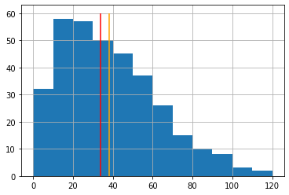

Статистички и графички приказ табеларних података
-------------------------------------------------

У табели типа *dataframe* можемо да имамо различите типове података.
Битно је само да су у једној колони сви подаци истог типа. Два
најважнија типа података, заправо групе типова, су номинални (или
категоријални, како их понекад зовемо) и нумерички подаци. Номинални
подаци означавају нека имена, називе или кратке текстуалне описе. Имена
општина представљају номиналне податке. Већина номиналних података су
стрингови који означавају различите објекте. Једина статистика коју
можемо да радимо са номиналним подацима јесте да пребројимо колико их
има, тј. да видимо колико се често појављују.

У табели ``dt`` имамо колону са именом општине у којој се школа налази.
Ако бисмо пребројали колико се пута појављују ови подаци, видели бисмо
колико различитих школа имамо у којој општини. Библиотека *pandas* нам
омогућава да то радимо помоћу функције ``.value_counts()`` коју
применимо на одговарајућу колону.

.. code:: ipython3

    vc=dt['Општина'].value_counts()
    print(vc)

.. parsed-literal::

    Нови Сад       10
    Лесковац        8
    Суботица        7
    Зрењанин        6
    Панчево         6
                   ..
    Кањижа          1
    Ириг            1
    Зубин Поток     1
    Звечан          1
    Штрпце          1
    Name: Општина, Length: 165, dtype: int64
    

Функција ``.value_counts()`` враћа податак типа *Series*, односно
индексирани низ вредности који дефинише *pandas* библиотека. Индексима,
односно називима појединачних елемената низа приступамо помоћу
``<име серије>.index``, а вредностима елемената низа помоћу
``<име серије>.values``. Конкретно, имена општина из серије ``vc``
позивамо са ``vc.index``, док вредности које смо добили пребројавањем
позивамо са ``vc.values``.

.. code:: ipython3

    vc.index

.. parsed-literal::

    Index(['Нови Сад', 'Лесковац', 'Суботица', 'Зрењанин', 'Панчево', 'Медијана',
           'Сомбор', 'Врање', 'Приштина', 'Крушевац',
           ...
           'Костолац', 'Косјерић', 'Ковачица', 'Кнић', 'Кладово', 'Кањижа', 'Ириг',
           'Зубин Поток', 'Звечан', 'Штрпце'],
          dtype='object', length=165)

.. questionnote:: Задатак 4
    
    Нацртајте стубичасти дијаграм који приказује број школа по општинама. Да би ознаке биле прегледне, узмите само неколико највећих вредности.

За разлику од номиналних вредности, нумеричке могу да се пореде
међусобно по величини. Са бројевима могу да се раде и рачунске
операције. Због тога су могућности за обраду и анализу нумеричких низова
много веће него за низове номиналних података. Наш основни задатак је да
цео низ података што једноставније и разумљивије представимо. Низ
података често поједностављено приказујемо помоћу карактеристичних
вредности, као што је нпр. средња вредност. Други важан начин је да цео
низ података прикажемо графички како бисмо податке могли да “видимо”.

Описивање низова података преко карактеристичних вредности
~~~~~~~~~~~~~~~~~~~~~~~~~~~~~~~~~~~~~~~~~~~~~~~~~~~~~~~~~~

.. infonote::
    
    За рачунање средње вредности се користи *pandas* функција ``.mean()`` која се примењује на нумеричку колону у табели. 

Користећи табелу израчунаћемо средњу вредност броја преосталих места по школама.

.. code:: ipython3

    dt['Преостало места'].mean()

.. parsed-literal::

    38.221574344023324

Средња вредност броја преосталих места је приближно 38. Друга
статистичка мера којом често описујемо низ бројева је медијана. Њу
рачунамо помоћу *pandas* функције ``.median()``.

.. infonote:: 

   **Медијана** је математичка функција која нам даје средишњу вредност
   за низ који је сортиран по величини. Она дели низ на два дела са
   истим бројем елемената. Ако низ, на пример, садржи висине 101
   ученика, медијана нам даје висину 51. највишег ученика. Од њега има
   50 виших и 50 нижих, док је он у самој средини. Ако имамо паран број
   ученика, онда нема ученика који је баш у средини, па се медијана
   рачуна мало другачије: као средња вредност висине првог елемента
   испод и првог изнад те средине. То значи да је медијана низа од 100
   бројева, средња вредност 50. и 51. највеће вредности овог низа.

.. code:: ipython3

    dt['Преостало места'].median()

.. parsed-literal::

    34.0

.. suggestionnote::

    Уочите колика је разлика између средње вредности и медијане за број преосталих места. Средња вредност је углавном већа код свих низова података где има много малих и мало великих вредности.

Погледајте хистограм броја преосталих места по школама. Највише је оних
где има двадесетак слободних места које видимо као високе стубиће са
леве стране, док је са десне стране мањи број школа са много слободних
места. Не улазећи даље у тумачење података, хоћемо само да покажемо да
се средња вредност и медијана разликују. На графикону доле, црвеном
линијом је обележена медијана, а наранџастом средња вредност. Пробајте
сами да откријете шта ради која линија у програму.

.. code:: ipython3

    mArea=dt['Преостало места'].mean()
    mdArea=dt['Преостало места'].median()
    plt.hist(dt['Преостало места'],12,range=(0,120))   # interval od 0 do 119 delimo na 12 podintervala
    plt.grid()
    plt.vlines(mArea,0,60,colors='orange')
    plt.vlines(mdArea,0,60,colors='red');

.. questionnote:: Задатак 5
    
    Одредите средњу вредност и медијану за минимални број бодова по школама.

.. questionnote:: Задатак 6
    
    Нацртајте хистограм минималног броја бодова по школама.
