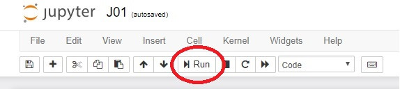

Џупитер (*Jupyter*) уме да рачуна и извршава Пајтон програме
==============================================================================================

Свака Џупитер *радна свеска* се састоји из низа ћелија, а свака ћелија може да садржи текст, математички израз или низ Пајтон
наредби. За сада нећемо објашњавати како се у Џупитер ћелију уноси текст, већ ћемо пажњу усмерити на рачунање израза и извршавање Пајтон наредби.

.. ytpopup:: mImADOceGoc
   :width: 735
   :height: 415
   :align: center

Када се у Џупитер ћелију унесе неки израз или Пајтон наредба садржај ћелије се може израчунати тако што се кликне на дугме **Run** при врху стране:

или се на тастатури притисне [CTRL]+[ENTER]

Ево примера:

.. ipython::

   In [1]: 3 * 19

   In [1]: (12 + 51) * 14

   In [1]: 2**(5**3)

.. questionnote::

   Коју операцију у Пајтону означавамо са  две звездице?

Понекад је згодно именовати вредности, поготово ако се ради о компликованим бројевима као што је то :math:`\pi` или када се ради о компликованим изразима. Те вредности касније можемо да користимо тако што наведемо име које смо им дали. На пример, процењује се да је на дан 1.7.2019. на свету било 7.714.576.923 људи. Наредба

``BrLjudiNaSvetu_2019 = 7714576923``

ће у систем увести нову променљиву ``BrLjudiNaSvetu_2019`` којој ће бити додељена вредност 7714576923. Да се подсетимо: имена променљивих у Пајтону морају да почну словом и могу да садрже слова, цифре и специјални знак _ (доња црта).

.. ipython::

   In [1]: BrLjudiNaSvetu_2019 = 7714576923

Након извршавања ове ћелије систем неће вратити никакав одговор. Просто је запамтио да променљива ``BrLjudiNaSvetu_2019`` има вредност 7.714.576.923. Процењује се да 27,8% становништва света живи у градовима. То значи да у градовима живи оволико људи:

.. ipython::

   In [1]: BrLjudiNaSvetu_2019 * 27.8 / 100

Приметимо да се приликом записивања децималних бројева у Пајтону користи *децимална тачка*, а не децимални зарез, како је то прописано нашим правописом!
Хајде сада да решимо још један задатак.

Задатак
--------------

Милица је желела да купи панталоне које су коштале 6.799,99 динара, али јој је мама рекла да су прескупе. Зато је Милица сачекала сезону снижења и када је следећи пут обишла продавницу видела је да је цена панталона снижена за 25%. Мама је пристала да јој купи панталоне по сниженој цени. Када су дошле до касе пријатно су биле изненађене чињеницом да су добиле попуст од 3% на већ снижену цену зато што је њена мама панталоне платила готовином. Колико су на крају коштале панталоне?

.. ipython::

   In [1]: cena = 6799.99
      ...: popust1 = cena * 25 / 100
      ...: niza_cena = cena - popust1
      ...: popust2 = niza_cena * 3 / 100
      ...: niza_cena - popust2

Прве четири наредбе су наредбе доделе: неким променљивим додељујемо неке вредности. Последња наредба садржи само математички израз. Пошто радимо у интерактивном окружењу (што значи да Џупитер одмах даје одговоре на питања која му поставимо), ако је последња наредба у ћелији само израз систем ће вратити вредност тог израза као резултат извршавања ћелије.

Претходни програм смо могли да напишемо и овако:

.. ipython::

   In [1]: cena = 6799.99
      ...: popust1 = cena * 25 / 100
      ...: niza_cena = cena - popust1
      ...: popust2 = niza_cena * 3 / 100
      ...: print("Pantalone su na kraju kostale", niza_cena - popust2, "din")

Овај пут наредба ``print`` *исписује* вредност израза, а систем *ништа не враћа као резултат извршавања ћелије* (примети да након извршавања ћелије систем није вратио одговор у облику ``Out[ ]:``).

При раду са интерактивним окружењима згодно је усвојити следећи манир: наредбу ``print`` користимо само у ситуацијама у којима треба да прикажемо вредности неколико израза, или ако желимо да испис мало улепшамо, као у претходном примеру.

