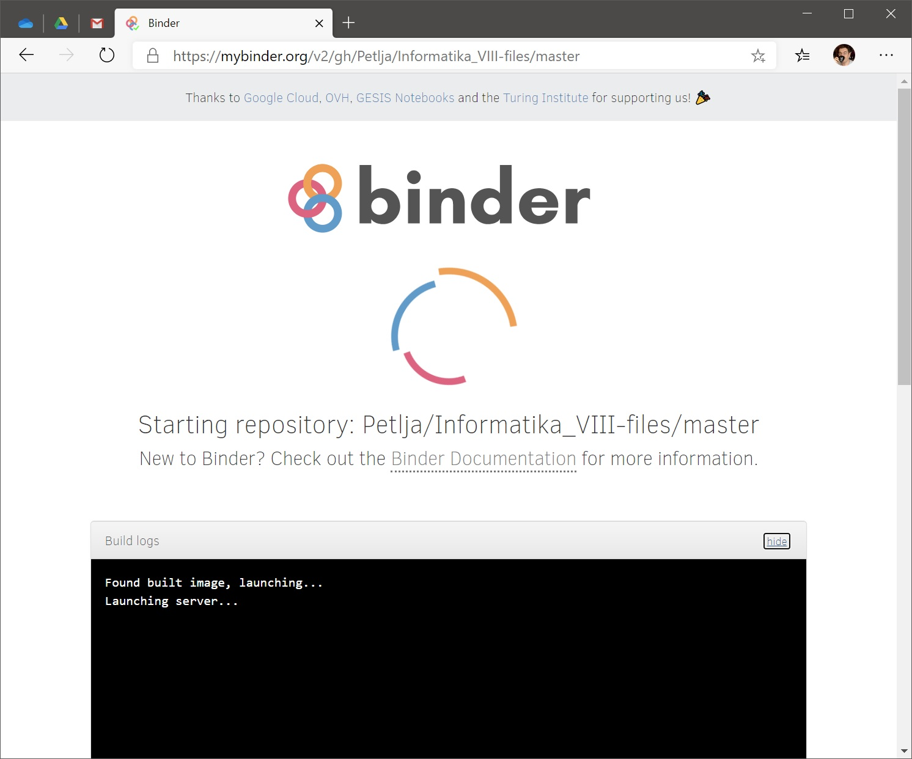
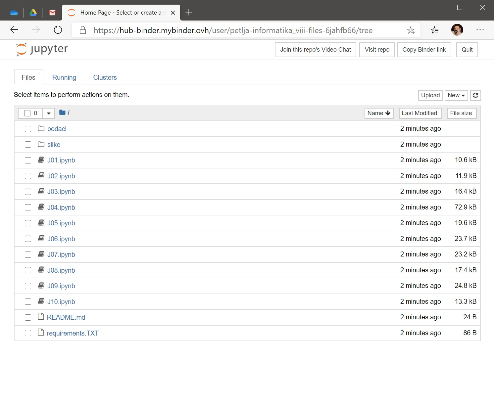
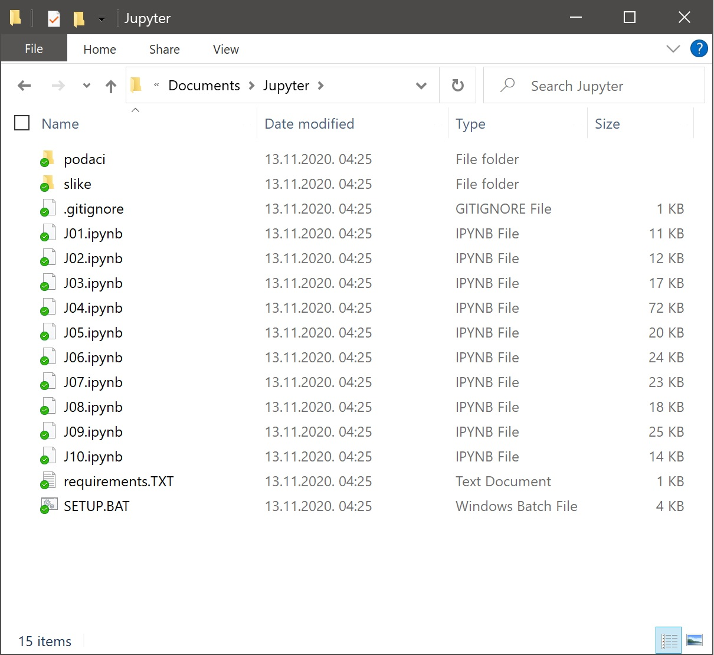
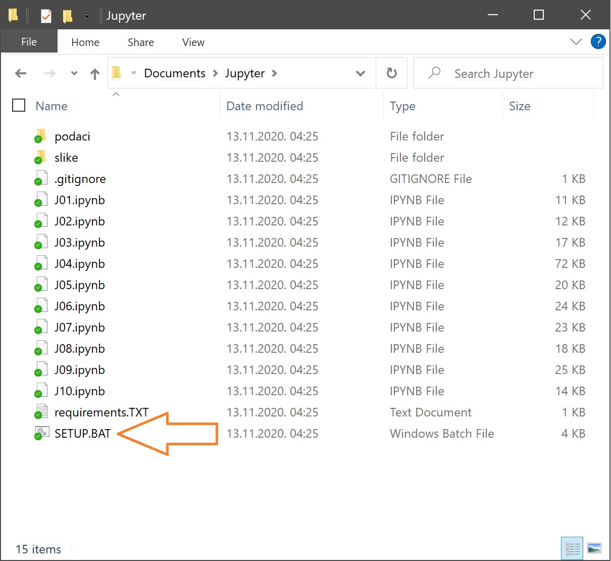
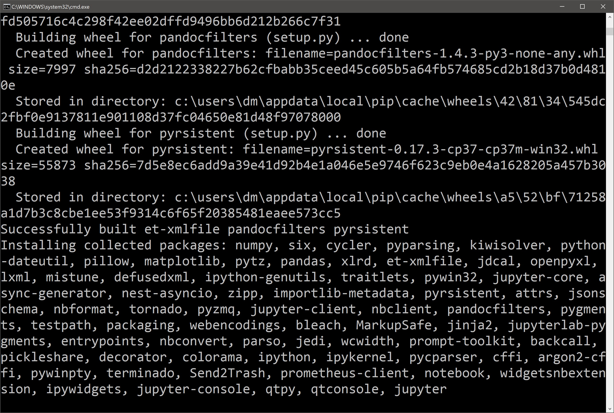
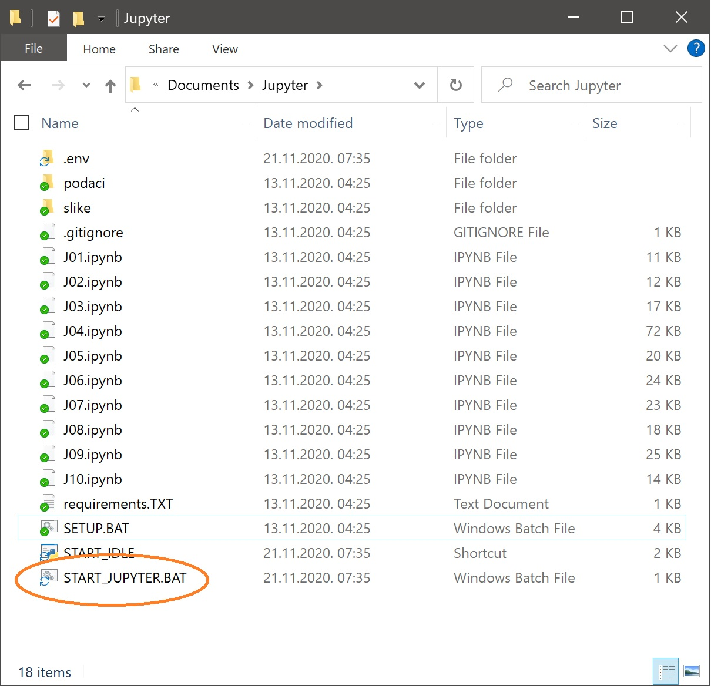
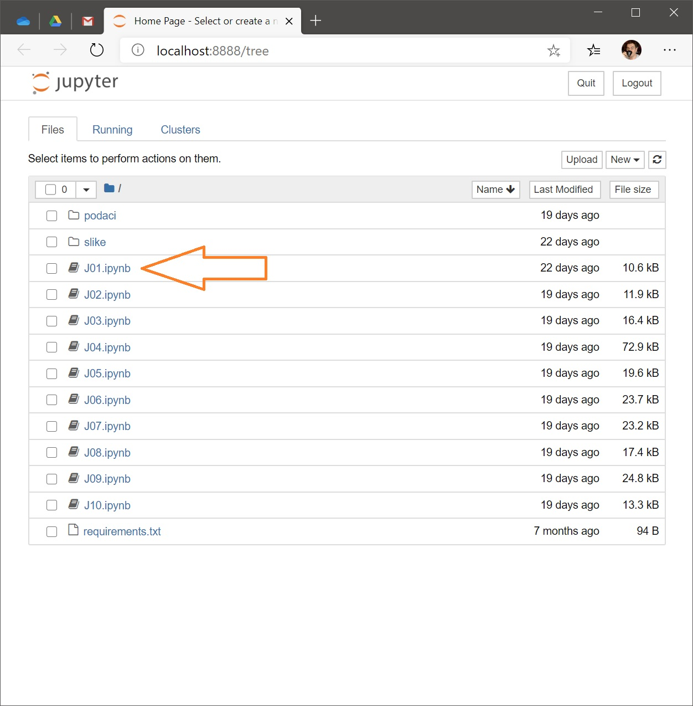

Џупитер (*Jupyter*) је радна свеска 21. века
============================================

.. infonote::

   Обрада података путем јасно наведених кратких програма представља најфлексибилнији
   начин обраде података и представља окосницу сваког озбиљног система за обраду података у 21. веку.
   **Зато је важно да се сви сретнемо са програмирањем, чак иако не планирамо сви да будемо програмери!**

Џупитер (*Jupyter*) је интерактивна радна свеска у коју можеш да уносиш текст (као текст ког управо читаш), да рачунаш,
да покрећеш једноставније Пајтон програме, да обрађујеш податке, да приказујеш податке у виду табеле и дијаграма,
и још много тога. При томе је Џупитер бесплатан: можеш га слободно преузети и инсталирати на свој рачунар, или
из било ког веб-прегледача користити неки од бесплатних Џупитер сервиса.

.. questionnote::

   Потражи на Интернету појам *open source* (= софтверски пројекат *отвореног кода*).
   Иди на `сајт Џупитер пројекта <https://jupyter.org/about>`_
   па провери да ли и Џупитер спада у категорију *open source* пројеката.

Пре него што кренемо у причу о обради и визуелизацији података у Пајтону користећи
Џупитер као радно окружење, показаћемо како можеш да покренеш Џупитер радне свеске
користећи један бесплатан веб-сервис, и "локално" на свом рачунару.

Покретање Џупитер радних свески помоћу сервиса *Binder*
"""""""""""""""""""""""""""""""""""""""""""""""""""""""""""""""""

Најједноставнији начин да отвориш Џупитер интерактивне радне свеске које прате овај курс је да одеш на следећи линк:

`https://mybinder.org/v2/gh/Petlja/Informatika_VIII-files/master <https://mybinder.org/v2/gh/Petlja/Informatika_VIII-files/master>`_

Сервис ће направити нову копију свих радних свески које прате овај курс и припремиће окружење у коме може да се извршава Џупитер. Припрема може да
потраје и до 10 минута, тако да је потербно мало стрпљења да се цео систем иницијализује.

Препознаћеш да је све готово када се у веб прегледачу (*web browser*) на твом рачунару *отвори нова страница*
на којој се виде *плави* линкови на радне свеске. Кликом на име, радна свеска се отвара у новом табу веб прегледача:

Крени да читаш свеске и да их извршаваш корак по корак.

За приступ Џупитер радним свескама на овај начин не треба ништа инсталирати и не треба креирати никакав налог. Треба бити само мало стрпљив. Међутим, цена коју плаћамо је да се измене у свескама *не* чувају.

Овај начин приступања Џупитер радним свескама нам даје могућност да брзо бацимо поглед на то како свеске изгледају.

Ево и кратког видеа у коме је ово демонстрирано:

.. ytpopup:: X4vVmTl4QoI
   :width: 735
   :height: 415
   :align: center

Покретање Џупитер радних свески на твом рачунару
"""""""""""""""""""""""""""""""""""""""""""""""""""""""

Ово је свакако најфлексибилнији начин да се користе Џупитер радне свеске, али зато захтева највише припрема.

Корак 1.
----------

Ако имаш инсталиран Пајтон на свом рачунару пређи на Корак 2.

Ако немаш инсталиран Пајтон на свом рачунару, прати први део следећег упутства (за рад са Џупитер радним свескама ти *PyGame* не треба, зато је довољно пратити само први део упутства који се односи на Пајтон):

`Упутство за инсталацију Пајтона <https://petljamediastorage.blob.core.windows.net/root/Media/Default/Help/Uputstvo%20Python%20pygame.pdf>`_

Корак 2.
-------------

Са следећег линка

`https://github.com/Petlja/Informatika_VIII-files/archive/master.zip <https://github.com/Petlja/Informatika_VIII-files/archive/master.zip>`_

преузми ZIP фајл и распакуј га у неки фолдер на свом рачунару:

Потом покрени команду SETUP.BAT тако што ћеш два пута кликнути на њено име:

Ова команда ће радити неко време и при томе ће инсталирати све неопходне библиотеке
за рад са Џупитер окружењем:

Када се команда заврши у фолдеру ће се појавити команда START_JUPYTER.BAT:

За покретање Џупитера треба само да покренеш ову команду
тако што ћеш два пута кликнути на њено име.

На твом рачунару ће се отворити веб прегледач са страном на којој се виде линкови на радне свеске.
Кликом на име, радна свеска се отвара у новом табу веб прегледача:

Крени да читаш свеске и да их извршаваш корак по корак.

Ево и кратког видеа у коме је ово демонстрирано:

.. ytpopup:: bOmEZc1aLwo
   :width: 735
   :height: 415
   :align: center

