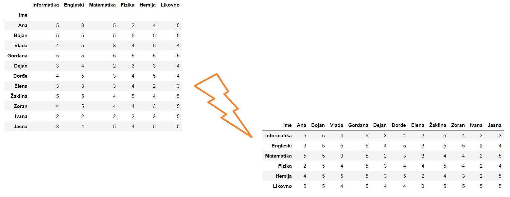

Транспоновање табеле
==================================

.. infonote::

      Замена врста и колона табеле се зове *транспоновање*.
      Приликом транспоновања имена колона полазне табеле постају индекси нове табеле,
      док индексна колона полазне табеле одређује имена колона нове табеле.

Транспоновање се често користи када табела има мало веома дугачких редова, па је у неким ситуацијама лакше посматрати транспоновану табелу која онда има пуно релативно кратких редова. Функције ``head`` и ``tail`` нам тада омогућују да се брзо упознамо са почетком и крајем табеле и да стекнемо неку интуицију о томе како табела изгледа.

.. infonote::

       Са табелама може радити и без транспоновања, јер све што можемо да урадимо
       на колонама табеле можемо да урадимо и на врстама.
       И поред тога, транспоновање се често користи јер је библиотека ``pandas`` оптимизована за рад по колонама табеле.

Табела се транспонује тако што се на њу примени функција ``Т`` која као резултат враћа нову, транспоновану табелу.
Ево примера са оценама:

.. ipython::

   In [1]: ocene1

Транспоновану табелу добијамо овако:

.. ipython::

   In [1]: ocene2 = ocene1.T

.. ipython::

   In [1]: ocene2

Хајде још да се уверимо да су врсте и колоне замениле места и у пољима ``index`` и ``columns``. У полазној табели је:

.. ipython::

   In [1]: ocene1.index

.. ipython::

   In [1]: ocene1.columns

А у транспонованој табели је:

.. ipython::

   In [1]: ocene2.index

.. ipython::

   In [1]: ocene2.columns

Како смо раније већ видели, просек оцена по предметима добијамо лако:

.. ipython::

   In [1]: for predmet in ocene1.columns:
      ...:     print(predmet, "->", round(ocene1[predmet].mean(), 2))

Да бисмо добили просек оцена по ученицима, можемо да приступимо врстама табеле користећи функцију ``loc`` како смо то већ видели, али можемо и да употребимо транспоновану табелу (рачунање просека по колонама, јер су колоне транспоноване табеле заправо врсте полазне табеле):

.. ipython::

   In [1]: for ucenik in ocene2.columns:
      ...:     print(ucenik, "->", round(ocene2[ucenik].mean(), 2))

