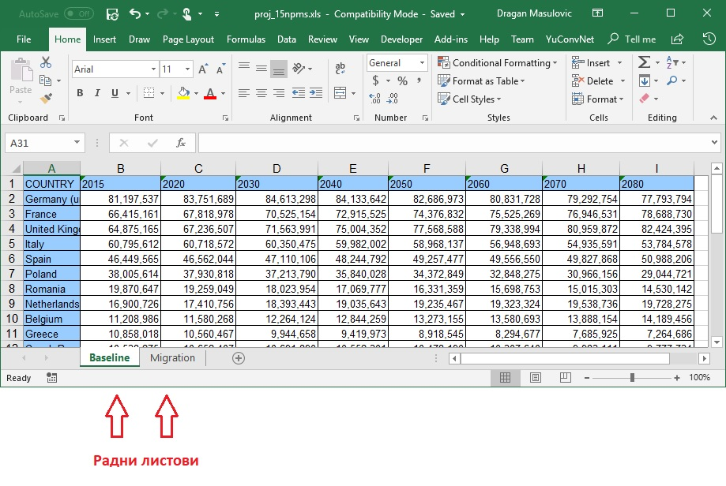

Учитавање података из Ексел датотека
============================================

Мајкрософтов Ексел (*Microsoft Excel*) представља један од најраспрострањенијих софтверских производа за обраду табеларно представљених података. Библиотека *pandas* зато има функцију која може да учита податке представљене Ексел табелом.

Структура Ексел документа је релативно сложена јер у једном документу може да се налази више табела. Један Ексел документ се, зато, састоји из неколико *радних листова* (енгл. *work sheets*):

па функцији за учитавање Ексел табеле поред имена датотеке треба дати и име радног листа са кога се учитава табела. Уколико се не наведе име радног листа функција ће учитати табелу из првог радног листа на који наиђе. Ово обично користимо само у ситуацијама када смо сигурни да Ексел радна свеска има само један радни лист.

Сада ћемо из датотеке *Aditivi.xlsx* која се налази на удаљеном ресурсу учитати табелу из (јединог) радног листа "Адитиви":

.. ipython::

   In [1]: import pandas as pd
      ...: aditivi = pd.read_excel("https://petljamediastorage.blob.core.windows.net/root/Media/Default/Kursevi/informatika_VIII/podaci/Aditivi.xlsx",
      ...:           sheet_name="Адитиви")

Ова датотека садржи податке о адитивима, што су супстанце које се користе у индустрији. Неки од њих се користе и у индустрији хране. (Подаци су преузети из уџбеника биологије за 8. разред.)

Ево првих неколико редова табеле:

.. ipython::

   In [1]: aditivi.head(15)

Видимо да су ћелије које су биле празне у Ексел табели овде добиле специјалну вредност *NaN* што је скраћеница од *not a number* (енгл. "није број"). Ово је специјална вредност која се користи да се открију потенцијалне грешке које могу да настану приликом учитавања великих табела. У нашем случају празне ћелије у колони "Напомена" и треба да остану празне, па ћемо табелу учитати поново, с тим да ћемо "замолити Пајтон да искључи вештачку интелигенцију":

.. ipython::

   In [1]: aditivi = pd.read_excel("https://petljamediastorage.blob.core.windows.net/root/Media/Default/Kursevi/informatika_VIII/podaci/Aditivi.xlsx",
      ...:           sheet_name="Адитиви", na_filter=False)
      ...: aditivi.head(15)

Аргумент ``na_filter=False`` каже функцији ``read_excel`` да празне ћелије остану празне и да у њих не уноси вредност *NaN*.

Ево и кратке видео илустрације:

.. ytpopup:: _XYOWXzQnuI
   :width: 735
   :height: 415
   :align: center

Направићемо сада фреквенцијску анализу ове табеле на основу штетности адитива.

.. ipython::

   In [1]: aditivi["Штетност"].value_counts()

Профилтрираћемо табелу да бисмо излистали адитиве који могу изазвати рак.

.. ipython::

   In [1]: aditivi[aditivi.Напомена == "може изазвати рак"]

За крај, излистаћемо адитиве који су изузетно опасни или могу изазвати рак. У ту сврху треба да комбинујемо два критеријума:

.. code-block:: text

    Напомена == "може изазвати рак"  или  Штетност == "ИЗУЗЕТНО ОПАСАН"

Логички везник "или" се у библиотеци ``pandas`` означава симболом ``|``. Према томе, податке добијамо тако што табели проследимо следећи захтев за филтрирање:

.. ipython::

   In [1]: aditivi[(aditivi.Напомена == "може изазвати рак") | (aditivi.Штетност == "ИЗУЗЕТНО ОПАСАН")]

