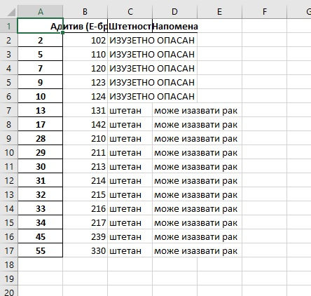
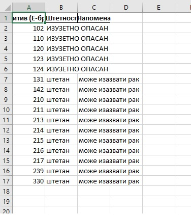

Уписивање табеле у Ексел датотеку
======================================

Било коју табелу можемо да упишемо и у Ексел датотеку као што смо их уписивали у *CSV* датотеке. Потребно је само позвати функцију ``to_excel`` и проследити јој име датотеке. На пример, ако је ``opasni_aditivi`` табела која садржи списак опасних адитива:

.. ipython::

   In [1]: opasni_aditivi = aditivi[(aditivi.Напомена == "може изазвати рак") | (aditivi.Штетност == "ИЗУЗЕТНО ОПАСАН")]

њу можемо уписати у Ексел датотеку овако:

.. code-block:: python

   opasni_aditivi.to_excel("opasni_aditivi.xlsx", encoding="utf-8")

Аргумент ``encoding="utf-8"`` морамо да проследимо функцији зато што у табели имамо податке који су записани ћирилицом, као што је био случај код писања у *CSV* датотеке. Ако сада отворимо ову датотеку из Ексела добићемо овакав изглед:

Видимо да је Пајтон уписао и индексну колону што нам у овом случају не одговара. Као и код уписивања у *CSV* датотеке можемо рећи Пајтону да у датотеку не уписује индексну колону тако што ћемо навести још и аргумент ``index=False``:

.. code-block:: python

   opasni_aditivi.to_excel("opasni_aditivi.xlsx", encoding="utf-8", index=False)

Ако сада нову датотеку учитамо из Ексела добијамо

За крај треба још мало проширити колоне у Ексел табели да би се улепшао њен изглед -- и готово!

Ево и кратке видео илустрације:

.. ytpopup:: eZgXkfdsvkI
   :width: 735
   :height: 415
   :align: center

