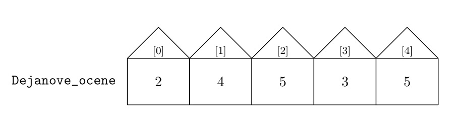
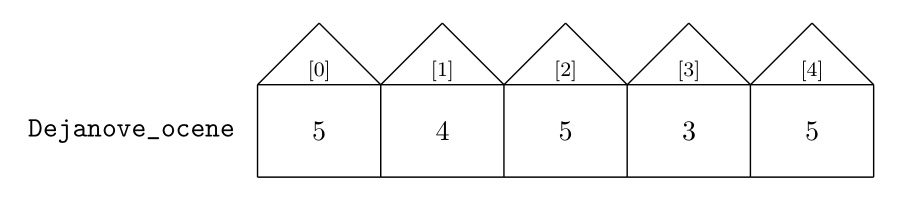

1. Увод у процесирање низова података
:::::::::::::::::::::::::::::::::::::

У овој лекцији ћемо:

1. поновити како се записују низови података,
2. поновити како се дефинишу функције,
3. написаћемо своју функцију која рачуна најмањи број у датом низу бројева, и
4. поновити неколико функција које су уграћене у Пајтон.

1.1. Записивање низова података
-------------------------------

Да се подсетимо, низови података се у Пајтону записују унутар угластих заграда,
у облику *листе*. На пример, оцене неког ученика из једног предмета могу да се запишу као низ овако:

..  code-block:: python

    >>> Dejanove_ocene = [2, 4, 5, 3, 5]

Ово је пример нумеричког низа података, где су сви подаци бројеви. Низ података, наравно, не
мора бити нумерички. На пример:

..  code-block:: python

    >>> predmeti = ["matematika", "srpski", "likovno", "istorija", "fizičko"]

или овако:

..  code-block:: python

    >>> Ocene = ["Dejan", 2, 4, 5, 5, 3]

Раније смо видели да подаци у низу могу бити и други низови података:

..  code-block:: python

    >>> Ocene_VIII3 = [
    ...    ["Dejan", 2, 4, 5, 5, 3],
    ...    ["Milica", 4, 5, 5, 4, 5],
    ...    ["Milan", 3, 4, 5, 5, 5]
    ... ]

О низу података можемо да размишљамо као о улици у којој свака кућица има свој кућни број.
Специфичност Пајтона је у томе да кућни бројеви увек почињу од 0, рецимо овако:

Број елемената низа се добија позивом уграђене функције ``len``
(од енглеског *length* што значи "дужина"):

..  code-block:: python

    >>> len(predmeti)
	5
	

Ако желимо да приступимо појединачној кућици довољно је да наведемо њену "адресу" која се,
као и поштанска адреса, састоји од имена улице иза кога се наводи кућни број, рецимо овако:

..  code-block:: python

    >>> Dejanove_ocene[0]
	2

Вредности бројева у кућицама се могу мењати веома једноставно.
Рецимо, ако Дејан поправо оцену која је уписана у прву кућицу
(*чији кућни број је 0!*) то можемо регистровати овако:

..  code-block:: python

    >>> Dejanove_ocene[0] = 5

Стање у улици ``Dejanove_ocene`` сада изгледа овако:

Ако узмемо да низ ``predmeti`` садржи имена предмета из којих је Дејан оцењен:

..  code-block:: python

    >>> predmeti
	['matematika', 'srpski', 'likovno', 'istorija', 'fizičko']

онда извештај о Дејановим оценама можемо генерисати овако:

..  code-block:: python

    >>> for i in range(5):
    ...     print(predmeti[i], Dejanove_ocene[i])
	matematika 5
	srpski 4
	likovno 5
	istorija 3
	fizičko 5

1.2. Дефинисање функција и минимум низа
---------------------------------------

Када неки компликован процес треба поновити више пута, погодно је издвојити га у посебну
малу целину (што се још зове и *функција*) и именовати га како бисмо касније могли да га
позовемо кадгод нам затреба. На пример, ево функције која исписује извештај о оценама неког
ученика:

..  code-block:: python

	>>> def izvestaj_o_ocenama(ime_ucenika, spisak_predmeta, ocene):
	... 	print("Učenik:", ime_ucenika)
	... 	print("Ocene:")
	... 	n = len(spisak_predmeta)
	... 	for i in range(n):
	... 		print(spisak_predmeta[i], ocene[i])

Извештај о Дејановим оценама сада лако можемо добити позивом ове функције:

..  code-block:: python

    >>> izvestaj_o_ocenama("Dejan", predmeti, Dejanove_ocene)
	Učenik: Dejan
	Ocene:
	matematika 5
	srpski 4
	likovno 5
	istorija 3
	fizičko 5

Ако је ово списак Милениних оцена из истих предмета:

..  code-block:: python

    >>> Milenine_ocene = [5,5,4,5,4]

извештај о њеним оценама можемо добити на исти начин:

..  code-block:: python

    >>> izvestaj_o_ocenama("Milena", predmeti, Milenine_ocene)
	Učenik: Milena
	Ocene:
	matematika 5
	srpski 5
	likovno 4
	istorija 5
	fizičko 4

Функције се најчешће користе за аутоматизацију релативно компликованих рачунских процеса.

Пример.
'''''''

Написати функцију ``min_niza(A)`` која одређује најмањи елемент низа ``A``
и враћа га као резучтат свог рада.

*Решење.* Погледајмо, прво, како бисмо овај проблем решили када тражимо мањи од два броја, А0 и А1:

..  code-block:: python

    >>> def manji_od_dva(A0, A1):
    ...     if A0 < A1: return A0
    ...     else: return A1

Дакле, ако је А0 мањи, то је резултат рада. У супротном је А1 резултат рада.

Ова идеја ради у случају два броја, али није погодна за уопштења.
Зато ћемо написати нову верзију функције ``manji_od_dva`` која на први поглед делује чудно,
али ће ускоро постати јасно зашто је погодна.

..  code-block:: python

	>>> def manji_od_dva_ponovo(A0, A1):
	... 	manji = A0
	... 	if A1 < manji: manji = A1
	... 	return manji

Идеја се састоји у томе да гледамо елементе један по један, као да нам долазе на траци. Када стигне први елемент, то је најмањи елемен кога смо до сада уочили. Када стугне други елемент проверимо како се он односи према до сада најмањем уоченом елементу и ако је мањи од најмањег до сада, он постаје нови најмањи елемент.

Ево како се идеја коју смо управо описали проширује на три елемента:

..  code-block:: python

	>>> def najmanji_od_tri(A0, A1, A2):
	... 	najmanji = A0
	... 	if A1 < najmanji: najmanji = A1
	... 	if A2 < najmanji: najmanji = A2
	... 	return najmanji

и на ситуацију са пет елемената:

..  code-block:: python

	>>> def najmanji_od_pet(A0, A1, A2, A3, A4):
	... 	najmanji = A0
	... 	if A1 < najmanji: najmanji = A1
	... 	if A2 < najmanji: najmanji = A2
	... 	if A3 < najmanji: najmanji = A3
	... 	if A4 < najmanji: najmanji = A4
	... 	return najmanji

Видимо да се корак који садржи ``if`` понавља за сваки елемент посебно.
Тако се ова идеја лако уопштава на произвољне низове:

..  code-block:: python

	>>> def min_niza(A):
	... 	najmanji = A[0]
	... 	for i in range(len(A)):
	... 		if A[i] < najmanji: najmanji = A[i]
	... 	return najmanji

Да проверимо како ова функција ради:

..  code-block:: python

	>>> min_niza([3,1,5,0,2])
	0

1.3. Стандардне функције
------------------------

Како би се писање програма поједноставило за велики број важних задатака који се веома
често користе у Пајтону већ постоје функције које их обављају. На пример, функција
``len`` рачуна дужину низа, као што смо већ видели:

..  code-block:: python

	>>> len(predmeti)
	5

Одређивање најмањег и највећег елемента низа бројева спадају међу важне задатке,
и зато Пајтон има уграђене функције ``min`` и ``max`` које могу да одреде најмањи,
односно, највећи елемент неколико бројева који су унапред наведени, или целог низа бројева:

..  code-block:: python

	>>> min(2,3)
	2
	>>> max(4,5,-1)
	5
	>>> min(Dejanove_ocene)
	3
	>>> max(Dejanove_ocene)
	5

1.4. Задаци
-----------

**Задатак 1.** У следеће низове унеси списак неких својих предмета и списак оцена
из тих предмета, па испиши извештај о оценама позивом функције ``izvestaj_o_ocenama``

..  code-block:: python

	>>> moji_predmeti = [] # <-- ovde unesi nekoliko predmeta
	>>> moje_ocene    = [] # <-- ovde unesi ocene iz tih predmeta
	>>> izvestaj_o_ocenama(   ,   ,   )  # <-- popuni podatke koji nedostaju

**Задатак 2.** Напиши функцију ``najveci_od_tri(A0, A1, A2)``
која рачуна  и враћа највећи од три дата броја, али без употребе стандардне функције ``max``.

**Задатак 3.** Напиши функцију ``najveci_od_pet(A0, A1, A2, A3, A4)``
која рачуна и враћа највећи од пет датих броја, али без употребе стандардне функције ``max``.

**Задатак 4.** Напиши функцију ``max_niza(A)`` која за дати низ ``А``
рачуна и враћа највећи елемент, али без употребе стандардне функције ``max``.

**Задатак 5.** Напиши функцију ``min_i_max(A)`` која исписује најмањи и највећи елемент
низа ``А``. (*Напомена: ова функција не треба да врати никакву вредност!
Она само треба да испише два броја на екран.*)

**Задатак 6*.** Напиши функцију ``srednji_od_tri(A0, A1, A2)``
која рачуна и враћа средњи од три дата броја.

